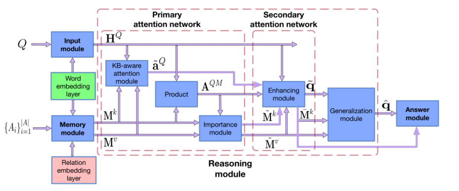
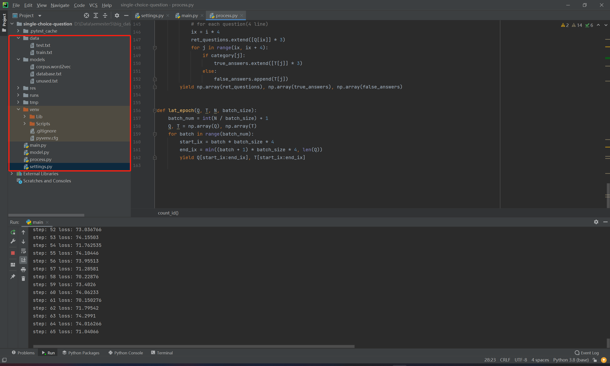
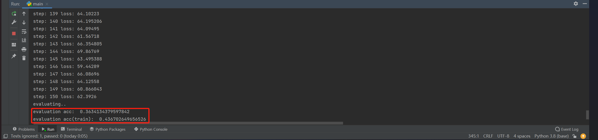
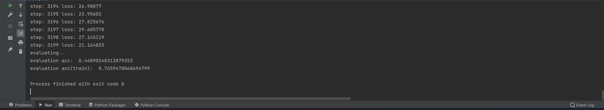

# Single-Choice-Question-Learning

##### anyone can download the corpus.word2vec by the `pan link`: https://pan.baidu.com/s/1dJi-DzsjK9WBuKSuXKjhcQ, `password`:n7hr

#### 工作摘要：实现了一个可以学习课本知识，然后实现答题的模型。
#### 成果：模型在学习知识后，在测试集（没有做过的题）上达到了44分/100分的成绩，在训练集（做过的题）上达到了77分/100分的成绩。希望之后能够将模型进一步优化，争取在测试集上达到60分/100分的成绩。

# This Report will be organized in those 5 parts
#### 1. Data Collection: data source
#### 2. Data Pre-processing: crawler
#### 3. Exploratory Analysis: model
#### 4. Data Mining: training
#### 5. Evaluation of Results: the evaluation index, the score

## 1. Data Collection: data source
### 数据来源
##### 题库来源: http://igeocn.com/igeocn/tiku/tk-1st/igeocn-qa-1.html (详情见`data/geo-multi-question.txt`)
##### 背景知识来源: https://www.liuxue86.com/gaokao/dilizhishidian/ (详情见`model/database_org.txt`)

## 2. crawler
##### 使用爬虫爬取知识源，详情见crawler.py

## 3. Exploratory Analysis: model
##### 网络的搭建使用到了 BAMnet 的思想，这个思想来自于 《Bidirectional Attentive Memory Networks for Question Answering over Knowledge Base》

##### 在知识的查询过程中同时考虑了背景知识和知识库的知识，在一定程度上解决了 incomplete KB 问题，这个思想参考了《improving QA over incomplete KBs with Knowledge-Aware Reader》

##### 代码结构

## 4. Data Mining: training

### 参数设置

| **sim_num**         | **rnn_size**   | **sigma** |
|---------- | -------------- | --------------- |
| 5       | 100           | 0.45              |
| **embedding_dim** | **max_len** | **lr** |
| 50  | 100             | 0.4               |
| **reg_factor** | **train_period** | **batch_size** |
| 0.5  | 50             | 256               |

### 训练中
##### 按照 **7:3** 比例将题库 `geo-multi-question.txt` 划分为 `test set` 和 `training set`
##### 运行 `process_db.py` 将 `database_org.txt` 进行预处理，输入到 `database.txt`
##### 训练轮数 = 150
##### evaluation accuracy of `test set` = 0.363
##### evaluation accuracy of `training set` = 0.437

## 5. Evaluation of Results: the evaluation index, the score

### 评估指标
##### 在测试集和训练集题目答题的正确率

### 训练结果
##### 总训练轮数 = 3199
##### evaluation accuracy of `test set` = 0.441
##### evaluation accuracy of `training set` = 0.766

### 结果分析
##### 虽然训练集合最终成绩较高(0.77)，但是测试集训练结果较低(0.44)。代码模拟了一个学生学习中学地理课本知识点去做地理竞赛题的过程，最终在测试集上得分为44分(百分制)，高于随机选择25分(百分制)，但结果也不算很高，究其原因，我分析后认为主要有2个：
###### 1. 地理竞赛题中有一些中学课本中没有涉及到的知识点
###### 2. 课本中知识体系用BiLstm简单建模效率较低。

## Reference
##### 《Bidirectional Attentive Memory Networks for Question Answering over Knowledge Base》
##### 《improving QA over incomplete KBs with Knowledge-Aware Reader
##### 参考学习了一些对知识库进行NLP建模的模型
